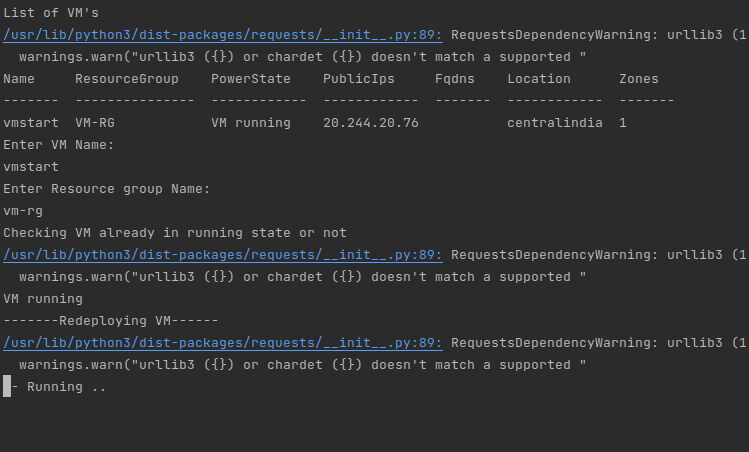
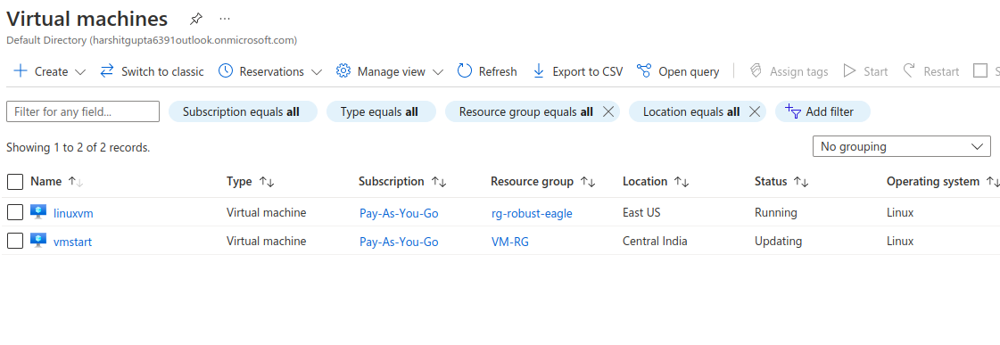
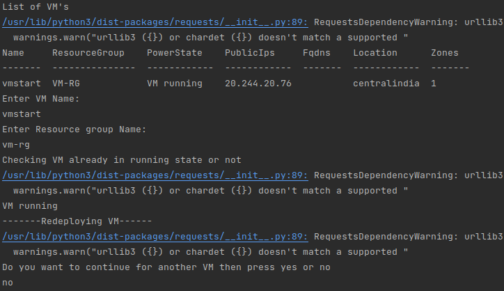

## Description

Here, In this template we will redeploy Azure VM from running state using the shell script.

---

#### Pre-requisite

* AZ Account
* Azure CLI

---

### Steps:-
1. Login into AZ account using `az login` or `az login --tenant <TENANT-ID>`
2. Change the permission of the file `chmod a+x change-vm-state.sh`
3. Go to the terminal and run the command `./vm-redploy.sh`

---

### Outputs
Here, In this output it's showing VM is redeploying :

Here, In this output it's updating the selected VM in Azure Cloud :

Here, In this output VM has been successfully re-deployed:

---
